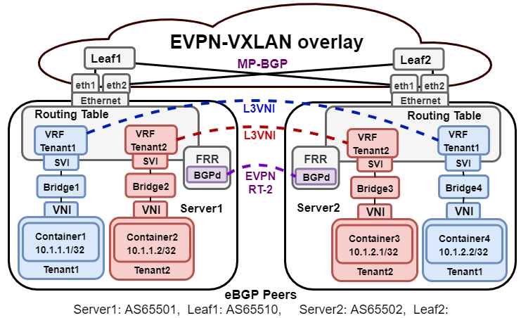

# Cumulus Routing on the Host Docker Advertisement daemon (CRoHDAd) - Ethernet Virtual Private Network (EVPN)
In this github project the Cumulus Routing on the Host Docker Advertisement daemon (CRoHDAd) was used in combination with Ethernet Virtual Private Network (EVPN) in order to advertise host (/32) routes of containers on one node to other nodes in a spine leaf data center environment. This was done through a VXLAN overlay between the nodes. Furthermore, the nodes were shared by multiple tenants. In order to allow for the sharing of resources, but maintain security and privacy of those tenants, a Virtual Routing and Forwarding (VRF) table was created per tenant. This VRF table contains only the routes of that tenant its containers. Meaning, the tenant does not know about other tenants and how to reach them. Meaning that no network policies are needed as done by other Kubernet Container Network Interfaces (CNIs) such as Calico or Cilium. Also a virtual bridge per tenant was used, to avoid L2 sniffing, since the other tenants could be potentially malicious. The created architecture for multi-tenancy with EVPN can be seen below.

The experiments and results with EVPN as CNI on a Kubernetes environment can be found in [experiments](experiments). Whereas experiment 1 focuses on inter-host connectivity and the traffic flow and experiment 2 focuses on multi-tenancy and traffic isolation.

In order to recreate the experiments or create a similar environment, one should first install the Kubernetes Master and nodes as is for example done in [How to install Kubernetes on Ubuntu 18.04 Bionic Beaver Linux](https://linuxconfig.org/how-to-install-kubernetes-on-ubuntu-18-04-bionic-beaver-linux). The dependencies could also be installed from the [kube_install script](scripts/kube_install.sh)

When all the nodes are joined to the Kubernetes master, the bash [scripts]() should be run. These scripts create 3 bridges and configures them based on the default /24 per node allocation from Kubernetes. After the bridges are created, the containers can be deployed. For the containers, the YAML files in [deployments]() were used. However, one can choose to deploy its own YAML files for the containers.
