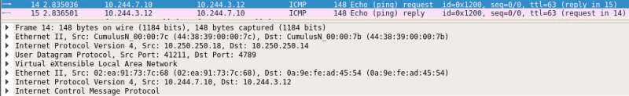
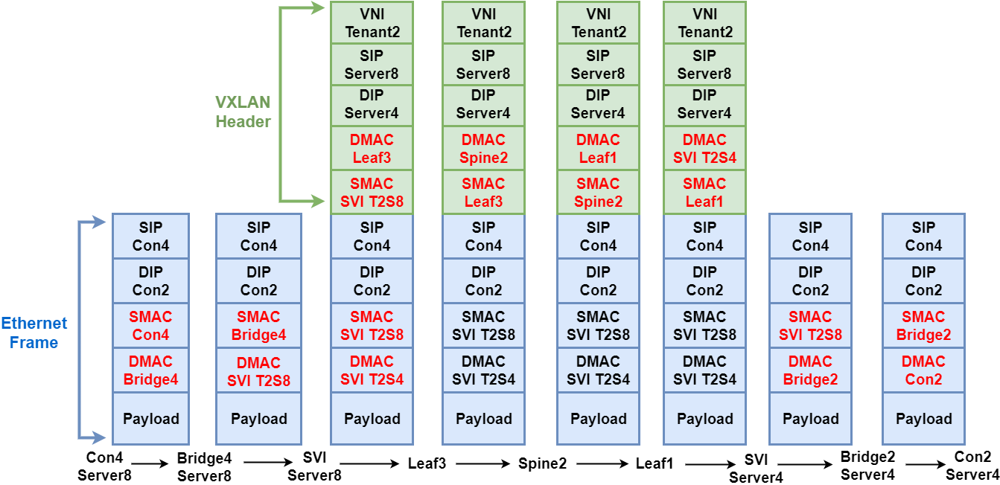

# Experiment 1: Connectivity and traffic flow
In the first experiment, the tenants do not share the node but share the network. This experiment was done in order to see if EVPN can be used as Container Network Interface (CNI) to allow for inter-host connectivity. Furthermore, the traffic flow was also analyzed. The Proof of Concept setup of experiment 1 in shown below. In this setup Server2 and Server6 that host Tenant1 were able to communicate and Server4 and Server8 of Tenant2 were able to communicate. No cross connectivity was possible between the containers of different tenants.


# Inter-host connectivity
## Overview
```
root@server01:/home/cumulus# kubectl get pods -o wide
NAME                              READY   STATUS    RESTARTS   AGE     IP             NODE
my-deployment1-7977bf45d4-gtsth   1/1     Running   0          2d9h    10.244.3.12    server04
my-deployment2-b58cb668d-w4kkz    1/1     Running   0          2d9h    10.244.7.10    server08
my-deployment3-5ccfdd455f-jnxgw   1/1     Running   0          2d5h    10.244.1.98   server02
my-deployment4-6cb9585895-jcbs7   1/1     Running   0          2d5h    10.244.5.4    server06
```

## Server04
### VRF Tenant2
```
root@server04:/home/cumulus# ip route sh vrf tenant2
10.244.3.0/24 dev cni0 proto kernel scope link src 10.244.3.1 
10.244.7.0/24 via 10.250.250.18 dev dummysvi404002 proto bgp metric 20 onlink 
10.244.7.10 via 10.250.250.18 dev dummysvi404002 proto bgp metric 20 onlink 
```

### Bridge2 (cni0) in Tenant2
```
root@server04:/home/cumulus# vtysh -c 'sh int cni0'
Interface cni0 is up, line protocol is up
  Link ups:       5    last: 2019/10/15 01:59:43.80
  Link downs:     4    last: 2019/10/15 01:59:43.80
  vrf: tenant2
  index 42 metric 0 mtu 1450 speed 0 
  flags: <UP,BROADCAST,RUNNING,MULTICAST>
  Type: Unknown
  HWaddr: be:58:3f:b6:cc:76
  inet 10.244.3.1/24
  inet6 fe80::bc58:3fff:feb6:cc76/64
  Interface Type Bridge
  Bridge VLAN-aware: no
```

### IP address of bridge2 (cni0)
```
root@server04:/home/cumulus# ifconfig cni0
cni0: flags=4163<UP,BROADCAST,RUNNING,MULTICAST>  mtu 1450
        inet 10.244.3.1  netmask 255.255.255.0  broadcast 0.0.0.0
        inet6 fe80::bc58:3fff:feb6:cc76  prefixlen 64  scopeid 0x20<link>
        ether be:58:3f:b6:cc:76  txqueuelen 1000  (Ethernet)
        RX packets 23  bytes 1204 (1.2 KB)
        RX errors 0  dropped 0  overruns 0  frame 0
        TX packets 40  bytes 3848 (3.8 KB)
        TX errors 0  dropped 0 overruns 0  carrier 0  collisions 0
```

### Global routing table
```
root@server04:/home/cumulus# ip route
10.250.250.10 proto bgp metric 20 
	nexthop via 169.254.0.1 dev eth1 weight 1 onlink 
	nexthop via 169.254.0.1 dev eth2 weight 1 onlink 
10.250.250.11 proto bgp metric 20 
	nexthop via 169.254.0.1 dev eth1 weight 1 onlink 
	nexthop via 169.254.0.1 dev eth2 weight 1 onlink 
10.250.250.12 proto bgp metric 20 
	nexthop via 169.254.0.1 dev eth1 weight 1 onlink 
	nexthop via 169.254.0.1 dev eth2 weight 1 onlink 
10.250.250.15 proto bgp metric 20 
	nexthop via 169.254.0.1 dev eth1 weight 1 onlink 
	nexthop via 169.254.0.1 dev eth2 weight 1 onlink 
10.250.250.16 proto bgp metric 20 
	nexthop via 169.254.0.1 dev eth1 weight 1 onlink 
	nexthop via 169.254.0.1 dev eth2 weight 1 onlink 
10.250.250.17 proto bgp metric 20 
	nexthop via 169.254.0.1 dev eth1 weight 1 onlink 
	nexthop via 169.254.0.1 dev eth2 weight 1 onlink 
10.250.250.18 proto bgp metric 20 
	nexthop via 169.254.0.1 dev eth1 weight 1 onlink 
	nexthop via 169.254.0.1 dev eth2 weight 1 onlink 
```

### Container IP of Container2 on Server4 and connectivity to Container4 on Server8 in VRF Tenant2
```
root@server04:/home/cumulus# docker exec -it 129846c9053d sh
/ # ip a
3: eth0@if47: <BROADCAST,MULTICAST,UP,LOWER_UP,M-DOWN> mtu 1450 qdisc noqueue state UP 
    link/ether d6:fa:6a:5b:70:7f brd ff:ff:ff:ff:ff:ff
    inet 10.244.3.12/24 scope global eth0
       valid_lft forever preferred_lft forever
       
       
/ # ping 10.244.3.1
PING 10.244.3.1 (10.244.3.1): 56 data bytes
64 bytes from 10.244.3.1: seq=0 ttl=64 time=0.408 ms
--- 10.244.3.1 ping statistics ---
1 packets transmitted, 1 packets received, 0% packet loss
round-trip min/avg/max = 0.408/0.408/0.408 ms


/ # ping 10.244.7.1
PING 10.244.7.1 (10.244.7.1): 56 data bytes
64 bytes from 10.244.7.1: seq=0 ttl=63 time=2.157 ms
64 bytes from 10.244.7.1: seq=1 ttl=63 time=1.755 ms
--- 10.244.7.1 ping statistics ---
2 packets transmitted, 2 packets received, 0% packet loss
round-trip min/avg/max = 1.755/1.956/2.157 ms


/ # ping 10.244.7.10
PING 10.244.7.10 (10.244.7.10): 56 data bytes
64 bytes from 10.244.7.10: seq=0 ttl=62 time=1.625 ms
64 bytes from 10.244.7.10: seq=1 ttl=62 time=1.593 ms
--- 10.244.7.10 ping statistics ---
2 packets transmitted, 2 packets received, 0% packet loss
round-trip min/avg/max = 1.593/1.609/1.625 ms
```

## Server08
### VRF Tenant2
```
root@server08:/home/cumulus# ip route sh vrf tenant2
10.244.3.0/24 via 10.250.250.14 dev dummysvi404002 proto bgp metric 20 onlink 
10.244.3.12 via 10.250.250.14 dev dummysvi404002 proto bgp metric 20 onlink 
10.244.7.0/24 dev cni0 proto kernel scope link src 10.244.7.1 
10.244.7.10 dev cni0 scope link 
```

### Bridge4 (cni0) in Tenant2
```
root@server08:/home/cumulus# address-family ipv4 unicast
address-family: command not found
root@server08:/home/cumulus# vtysh -c 'sh int cni0'
Interface cni0 is up, line protocol is up
  Link ups:       3    last: 2019/10/15 01:57:02.17
  Link downs:     2    last: 2019/10/15 01:57:02.17
  vrf: tenant2
  index 42 metric 0 mtu 1450 speed 0 
  flags: <UP,BROADCAST,RUNNING,MULTICAST>
  Type: Unknown
  HWaddr: be:f3:60:34:49:c2
  inet 10.244.7.1/24
  inet6 fe80::bcf3:60ff:fe34:49c2/64
  Interface Type Bridge
  Bridge VLAN-aware: no
```

### IP address of bridge4 (cni0)
```
root@server08:/home/cumulus# ifconfig cni0
cni0: flags=4163<UP,BROADCAST,RUNNING,MULTICAST>  mtu 1450
        inet 10.244.7.1  netmask 255.255.255.0  broadcast 0.0.0.0
        inet6 fe80::bcf3:60ff:fe34:49c2  prefixlen 64  scopeid 0x20<link>
        ether be:f3:60:34:49:c2  txqueuelen 1000  (Ethernet)
        RX packets 1680  bytes 102910 (102.9 KB)
        RX errors 0  dropped 0  overruns 0  frame 0
        TX packets 470  bytes 42079 (42.0 KB)
        TX errors 0  dropped 0 overruns 0  carrier 0  collisions 0
```

### Global routing table
```
root@server08:/home/cumulus# ip route
10.250.250.10 proto bgp metric 20 
	nexthop via 169.254.0.1 dev eth1 weight 1 onlink 
	nexthop via 169.254.0.1 dev eth2 weight 1 onlink 
10.250.250.11 proto bgp metric 20 
	nexthop via 169.254.0.1 dev eth1 weight 1 onlink 
	nexthop via 169.254.0.1 dev eth2 weight 1 onlink 
10.250.250.12 proto bgp metric 20 
	nexthop via 169.254.0.1 dev eth1 weight 1 onlink 
	nexthop via 169.254.0.1 dev eth2 weight 1 onlink 
10.250.250.14 proto bgp metric 20 
	nexthop via 169.254.0.1 dev eth1 weight 1 onlink 
	nexthop via 169.254.0.1 dev eth2 weight 1 onlink 
10.250.250.15 proto bgp metric 20 
	nexthop via 169.254.0.1 dev eth1 weight 1 onlink 
	nexthop via 169.254.0.1 dev eth2 weight 1 onlink 
10.250.250.16 proto bgp metric 20 
	nexthop via 169.254.0.1 dev eth1 weight 1 onlink 
	nexthop via 169.254.0.1 dev eth2 weight 1 onlink 
10.250.250.17 proto bgp metric 20 
	nexthop via 169.254.0.1 dev eth1 weight 1 onlink 
	nexthop via 169.254.0.1 dev eth2 weight 1 onlink 
```

### Container IP of Container4 on Server8 and connectivity to Container2 on Server4 in VRF Tenant2
```
root@server08:/home/cumulus# docker exec -it 7fced16e747b sh
/ # ip a
3: eth0@if47: <BROADCAST,MULTICAST,UP,LOWER_UP,M-DOWN> mtu 1450 qdisc noqueue state UP 
    link/ether 7e:13:ca:cf:ca:ca brd ff:ff:ff:ff:ff:ff
    inet 10.244.7.10/24 scope global eth0
       valid_lft forever preferred_lft forever
       
       
/ # ping 10.244.3.12
PING 10.244.3.12 (10.244.3.12): 56 data bytes
64 bytes from 10.244.3.12: seq=0 ttl=62 time=2.750 ms
64 bytes from 10.244.3.12: seq=1 ttl=62 time=1.628 ms
64 bytes from 10.244.3.12: seq=2 ttl=62 time=1.584 ms
--- 10.244.3.12 ping statistics ---
3 packets transmitted, 3 packets received, 0% packet loss
round-trip min/avg/max = 1.584/1.987/2.750 ms
```

## Server02
### VRF Tenant1
```
root@server02:/home/cumulus# ip route sh vrf tenant1
10.244.1.0/24 dev cni0 proto kernel scope link src 10.244.1.1
10.244.1.98 dev cni0 scope link
10.244.5.0/24 via 10.250.250.16 dev dummysvi404001 proto bgp metric 20 onlink
10.244.5.4 via 10.250.250.16 dev dummysvi404001 proto bgp metric 20 onlink
```

### Bridge1 (cni0) in Tenant1
```
root@server02:/home/cumulus# vtysh -c 'show int cni0'
Interface cni0 is up, line protocol is up
  Link ups:       3    last: 2019/10/17 18:41:01.52
  Link downs:     2    last: 2019/10/17 18:40:58.84
  vrf: tenant1
  index 42 metric 0 mtu 1450 speed 0
  flags: <UP,BROADCAST,RUNNING,MULTICAST>
  Type: Unknown
  HWaddr: ce:09:12:7d:0b:84
  inet 10.244.1.1/24
  inet6 fe80::cc09:12ff:fe7d:b84/64
  Interface Type Bridge
  Bridge VLAN-aware: no
```

### IP address of bridge1 (cni0)
```
root@server02:/home/cumulus# ifconfig cni0
cni0: flags=4163<UP,BROADCAST,RUNNING,MULTICAST>  mtu 1450
        inet 10.244.1.1  netmask 255.255.255.0  broadcast 0.0.0.0
        inet6 fe80::cc09:12ff:fe7d:b84  prefixlen 64  scopeid 0x20<link>
        ether ce:09:12:7d:0b:84  txqueuelen 1000  (Ethernet)
        RX packets 29  bytes 1820 (1.8 KB)
        RX errors 0  dropped 0  overruns 0  frame 0
        TX packets 47  bytes 4526 (4.5 KB)
        TX errors 0  dropped 0 overruns 0  carrier 0  collisions 0
```

### Global routing table
```
root@server02:/home/cumulus# ip route
10.250.250.10 proto bgp metric 20
        nexthop via 169.254.0.1 dev eth1 weight 1 onlink
        nexthop via 169.254.0.1 dev eth2 weight 1 onlink
10.250.250.12 proto bgp metric 20
        nexthop via 169.254.0.1 dev eth1 weight 1 onlink
        nexthop via 169.254.0.1 dev eth2 weight 1 onlink
10.250.250.14 proto bgp metric 20
        nexthop via 169.254.0.1 dev eth1 weight 1 onlink
        nexthop via 169.254.0.1 dev eth2 weight 1 onlink
10.250.250.15 proto bgp metric 20
        nexthop via 169.254.0.1 dev eth1 weight 1 onlink
        nexthop via 169.254.0.1 dev eth2 weight 1 onlink
10.250.250.16 proto bgp metric 20
        nexthop via 169.254.0.1 dev eth1 weight 1 onlink
        nexthop via 169.254.0.1 dev eth2 weight 1 onlink
10.250.250.17 proto bgp metric 20
        nexthop via 169.254.0.1 dev eth1 weight 1 onlink
        nexthop via 169.254.0.1 dev eth2 weight 1 onlink
10.250.250.18 proto bgp metric 20
        nexthop via 169.254.0.1 dev eth1 weight 1 onlink
        nexthop via 169.254.0.1 dev eth2 weight 1 onlink
```

### Container IP of Container1 on Server2 and connectivity to Container3 on Server6 in VRF Tenant1
```
root@server02:/home/cumulus# docker exec -it 5016fbcfc7cb sh
/ # ip a
3: eth0@if43: <BROADCAST,MULTICAST,UP,LOWER_UP,M-DOWN> mtu 1450 qdisc noqueue state UP
    link/ether 9e:13:1f:86:ac:fe brd ff:ff:ff:ff:ff:ff
    inet 10.244.1.98/24 scope global eth0
       valid_lft forever preferred_lft forever

/ # ping 10.244.1.1
PING 10.244.1.1 (10.244.1.1): 56 data bytes
64 bytes from 10.244.1.1: seq=0 ttl=64 time=0.408 ms
64 bytes from 10.244.1.1: seq=1 ttl=64 time=0.165 ms
--- 10.244.1.1 ping statistics ---
2 packets transmitted, 2 packets received, 0% packet loss
round-trip min/avg/max = 0.165/0.286/0.408 ms


/ # ping 10.244.5.1
PING 10.244.5.1 (10.244.5.1): 56 data bytes
64 bytes from 10.244.5.1: seq=0 ttl=63 time=2.311 ms
64 bytes from 10.244.5.1: seq=1 ttl=63 time=2.249 ms
64 bytes from 10.244.5.1: seq=2 ttl=63 time=2.384 ms
--- 10.244.5.1 ping statistics ---
3 packets transmitted, 3 packets received, 0% packet loss
round-trip min/avg/max = 2.249/2.314/2.384 ms


/ # ping 10.244.5.4
PING 10.244.5.4 (10.244.5.4): 56 data bytes
64 bytes from 10.244.5.4: seq=0 ttl=62 time=2.080 ms
64 bytes from 10.244.5.4: seq=1 ttl=62 time=2.273 ms
64 bytes from 10.244.5.4: seq=2 ttl=62 time=2.033 ms
--- 10.244.5.4 ping statistics ---
3 packets transmitted, 3 packets received, 0% packet loss
round-trip min/avg/max = 2.033/2.128/2.273 ms
```


## Server06
### VRF Tenant1
```
root@server06:/home/cumulus# ip route sh vrf tenant1
10.244.1.0/24 via 10.250.250.11 dev dummysvi404001 proto bgp metric 20 onlink
10.244.1.98 via 10.250.250.11 dev dummysvi404001 proto bgp metric 20 onlink
10.244.5.0/24 dev cni0 proto kernel scope link src 10.244.5.1
10.244.5.4 dev cni0 scope link
```

### Bridge3 (cni0) in Tenant1
```
root@server06:/home/cumulus# vtysh -c 'show int cni0'
Interface cni0 is up, line protocol is up
  Link ups:       3    last: 2019/10/17 11:50:49.92
  Link downs:     2    last: 2019/10/17 11:50:47.35
  vrf: tenant1
  index 42 metric 0 mtu 1450 speed 0
  flags: <UP,BROADCAST,RUNNING,MULTICAST>
  Type: Unknown
  HWaddr: 6a:5e:a5:95:bd:10
  inet 10.244.5.1/24
  inet6 fe80::685e:a5ff:fe95:bd10/64
  Interface Type Bridge
  Bridge VLAN-aware: no
```

### IP address of bridge3 (cni0)
```
root@server06:/home/cumulus# ifconfig cni0
cni0: flags=4163<UP,BROADCAST,RUNNING,MULTICAST>  mtu 1450
        inet 10.244.5.1  netmask 255.255.255.0  broadcast 0.0.0.0
        inet6 fe80::685e:a5ff:fe95:bd10  prefixlen 64  scopeid 0x20<link>
        ether 6a:5e:a5:95:bd:10  txqueuelen 1000  (Ethernet)
        RX packets 25  bytes 1540 (1.5 KB)
        RX errors 0  dropped 0  overruns 0  frame 0
        TX packets 40  bytes 3868 (3.8 KB)
        TX errors 0  dropped 0 overruns 0  carrier 0  collisions 0
```

### Global routing table
```
root@server06:/home/cumulus# ip route
10.250.250.10 proto bgp metric 20
        nexthop via 169.254.0.1 dev eth1 weight 1 onlink
        nexthop via 169.254.0.1 dev eth2 weight 1 onlink
10.250.250.11 proto bgp metric 20
        nexthop via 169.254.0.1 dev eth1 weight 1 onlink
        nexthop via 169.254.0.1 dev eth2 weight 1 onlink
10.250.250.12 proto bgp metric 20
        nexthop via 169.254.0.1 dev eth1 weight 1 onlink
        nexthop via 169.254.0.1 dev eth2 weight 1 onlink
10.250.250.14 proto bgp metric 20
        nexthop via 169.254.0.1 dev eth1 weight 1 onlink
        nexthop via 169.254.0.1 dev eth2 weight 1 onlink
10.250.250.15 proto bgp metric 20
        nexthop via 169.254.0.1 dev eth1 weight 1 onlink
        nexthop via 169.254.0.1 dev eth2 weight 1 onlink
10.250.250.17 proto bgp metric 20
        nexthop via 169.254.0.1 dev eth1 weight 1 onlink
        nexthop via 169.254.0.1 dev eth2 weight 1 onlink
10.250.250.18 proto bgp metric 20
        nexthop via 169.254.0.1 dev eth1 weight 1 onlink
        nexthop via 169.254.0.1 dev eth2 weight 1 onlink
```

### Container IP of Container3 on Server6 and connectivity to Container1 on Server2 in VRF Tenant1
```
root@server06:/home/cumulus# docker exec -it f2c3b88744f3 sh
/ # ip a
3: eth0@if43: <BROADCAST,MULTICAST,UP,LOWER_UP,M-DOWN> mtu 1450 qdisc noqueue state UP
    link/ether 5a:b4:0d:7d:66:2b brd ff:ff:ff:ff:ff:ff
    inet 10.244.5.4/24 scope global eth0
       valid_lft forever preferred_lft forever


/ # ping 10.244.5.1
PING 10.244.5.1 (10.244.5.1): 56 data bytes
64 bytes from 10.244.5.1: seq=0 ttl=64 time=0.372 ms
64 bytes from 10.244.5.1: seq=1 ttl=64 time=0.115 ms
64 bytes from 10.244.5.1: seq=2 ttl=64 time=0.153 ms
--- 10.244.5.1 ping statistics ---
3 packets transmitted, 3 packets received, 0% packet loss
round-trip min/avg/max = 0.115/0.213/0.372 ms


/ # ping 10.244.1.1
PING 10.244.1.1 (10.244.1.1): 56 data bytes
64 bytes from 10.244.1.1: seq=0 ttl=63 time=15.447 ms
64 bytes from 10.244.1.1: seq=1 ttl=63 time=1.908 ms
64 bytes from 10.244.1.1: seq=2 ttl=63 time=1.680 ms
--- 10.244.1.1 ping statistics ---
3 packets transmitted, 3 packets received, 0% packet loss
round-trip min/avg/max = 1.680/6.345/15.447 ms


/ # ping 10.244.1.98
PING 10.244.1.98 (10.244.1.98): 56 data bytes
64 bytes from 10.244.1.98: seq=0 ttl=62 time=2.061 ms
64 bytes from 10.244.1.98: seq=1 ttl=62 time=2.035 ms
64 bytes from 10.244.1.98: seq=2 ttl=62 time=2.442 ms
--- 10.244.1.98 ping statistics ---
3 packets transmitted, 3 packets received, 0% packet loss
round-trip min/avg/max = 2.035/2.179/2.442 ms
```

## Cross connectivity
### No cross connectivity from Container3 on Server6 to Container2/Bridge2 on Server4 and Container4/Bridge4 on Server8
```
root@server06:/home/cumulus# docker exec -it f2c3b88744f3 sh
/ # ip a
3: eth0@if43: <BROADCAST,MULTICAST,UP,LOWER_UP,M-DOWN> mtu 1450 qdisc noqueue state UP
    link/ether 5a:b4:0d:7d:66:2b brd ff:ff:ff:ff:ff:ff
    inet 10.244.5.4/24 scope global eth0
       valid_lft forever preferred_lft forever


/ # ping 10.244.3.1
PING 10.244.3.1 (10.244.3.1): 56 data bytes
--- 10.244.3.1 ping statistics ---
3 packets transmitted, 0 packets received, 100% packet loss


/ # ping 10.244.3.12
PING 10.244.3.12 (10.244.3.12): 56 data bytes
--- 10.244.3.12 ping statistics ---
3 packets transmitted, 0 packets received, 100% packet loss


/ # ping 10.244.7.1
PING 10.244.7.1 (10.244.7.1): 56 data bytes
--- 10.244.7.1 ping statistics ---
3 packets transmitted, 0 packets received, 100% packet loss
/ # ping 10.244.7.10


PING 10.244.7.10 (10.244.7.10): 56 data bytes
--- 10.244.7.10 ping statistics ---
3 packets transmitted, 0 packets received, 100% packet loss
```

### No cross connectivity from Container2 on Server4 to Container1/Bridge1 on Server2 and Container3/Bridge3 on Server6
```
root@server04:/home/cumulus# docker exec -it 129846c9053d sh
/ # ip a
3: eth0@if47: <BROADCAST,MULTICAST,UP,LOWER_UP,M-DOWN> mtu 1450 qdisc noqueue state UP
    link/ether d6:fa:6a:5b:70:7f brd ff:ff:ff:ff:ff:ff
    inet 10.244.3.12/24 scope global eth0
       valid_lft forever preferred_lft forever


/ # ping 10.244.1.1
PING 10.244.1.1 (10.244.1.1): 56 data bytes
--- 10.244.1.1 ping statistics ---
3 packets transmitted, 0 packets received, 100% packet loss


/ # ping 10.244.1.98
PING 10.244.1.98 (10.244.1.98): 56 data bytes
--- 10.244.1.98 ping statistics ---
3 packets transmitted, 0 packets received, 100% packet loss


/ # ping 10.244.5.1
PING 10.244.5.1 (10.244.5.1): 56 data bytes
--- 10.244.5.1 ping statistics ---
3 packets transmitted, 0 packets received, 100% packet loss
/ # ping 10.244.5.4


PING 10.244.5.4 (10.244.5.4): 56 data bytes
--- 10.244.5.4 ping statistics ---
3 packets transmitted, 0 packets received, 100% packet loss
```

# Traffic flow
In the traffic flow, we looked into Ethernet Frame and VXLAN header from Container4 on Server8 towards Container2 on Server4. An example of the VXLAN header can be seen in the figure below.



The full packet flow is depicted below. In red are the changes to the packet when it traverses the network. Note that only the MAC address changes (either in the Ethernet Frame or in the VXLAN header), meaning the containers think it is directly connected to the destined container.


